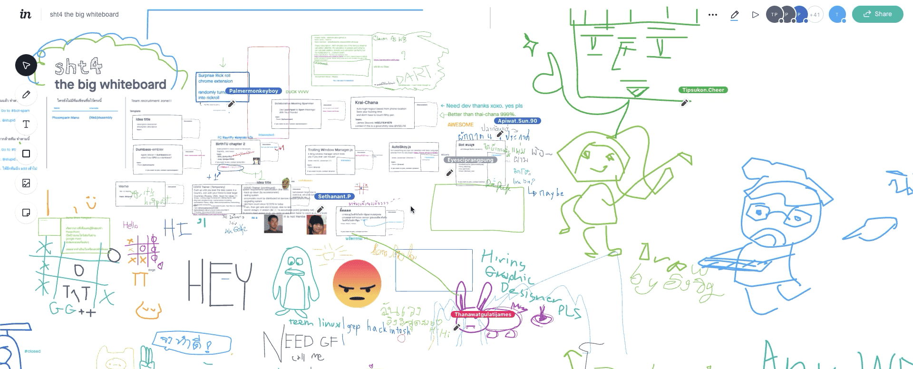

This was my 4th time that I help run a Stupid Hackathon in Thailand, and this is the first time it went virtual.

::: tip What is The Stupid Hackathon Thailand?

So many hackathons are just “business pitching contests.”
**The Stupid Hackathon Thailand** was founded out of frustrations of attending these “hackathons,”
inspired by [an event in New York with a similar but more aggressive name](https://stupidhackathon.com/).
Here we just make stupid stuff.
[Phoomparin](https://phoom.in.th/) founded it and I jumped in to help.

:::

This time the hackathon is **4 days long.** It starts on the Wednesday night, and ends on the Saturday night. This gives participants 3 nights and one day on the weekend. (We wouldn't be able to do this had the event not been virtual.)

## Design

We don’t have a dedicated designer for this event, so I took care of most of the design stuff.

Although I’m not good at design, I like designing for this event,
because it’s a stupid event and I don't have to care about the design quality that much.
I can be as [brutalist](https://brutalistwebsites.com/) as I like.

I wanted the design to be as procedural (can be represented as code) as possible, while looking somewhat unique.
I learned from [bill wurtz](http://billwurtz.com/)’s videos that you can make anything colorful by slapping `mix-blend-mode: difference` onto it.

::: tip sht4’s design

Take this picture, for instance:


And this random gradient:

<p>
  <a :style="{ background: bg }" class="gradient-container" @click="newColor" href="javascript://"></a>
</p>

Put the gradient on top of the image with `mix-blend-mode: difference`, and you get this.

<p>
  <a :style="{ background: bg }" class="gradient-container" @click="newColor" href="javascript://">
    
  </a>
</p>

Tap the above image to change the gradient.

:::

And that’s the main design theme for this event.

::: tip Generating a random gradient

This JavaScript code was used.

```js
const rand = () => Math.random() * 2 - 1
const mkdeg = () => ~~(Math.random() * 360)
const mkc = () => `hsl(${mkdeg()}deg, 100%, 50%)`
const mkg = () => `linear-gradient(${mkdeg()}deg, ${mkc()}, ${mkc()})`
```

:::

With that, I built the initial website…


## Website

Later, I expanded on [the event’s website](https://stupidhackth.github.io/4/) based on the same design ideas.


## The Virtual Space

Most of the event takes place in a Discord server (with the help of [The Stupid Bot](#the-stupid-bot)), as well as on Google Sheets.

### the main tables

Inspired by [!!Con 2020](http://bangbangcon.com/)’s spreadsheet party (had a lot of fun there!)…

<template>
  <TwitterEmbed>
    <p lang="en" dir="ltr">I made the initial spreadsheet, modeled after <a href="https://twitter.com/maxkreminski?ref_src=twsrc%5Etfw">@maxkreminski</a> and <a href="https://twitter.com/v21?ref_src=twsrc%5Etfw">@v21</a> (et als) previous Spreadsheet party, with basic conference amenities like a zine table, badge-making station, and snack table<br><br>Other attendees filled out stories, new pages, and Glitch experiments (and crabs) <a href="https://t.co/I0NUhykys2">pic.twitter.com/I0NUhykys2</a></p>&mdash; Kate Compton thinks its universal healthcare time (@GalaxyKate) <a href="https://twitter.com/GalaxyKate/status/1259625434343305216?ref_src=twsrc%5Etfw">May 10, 2020</a></blockquote>
  </TwitterEmbed>
</template>

…we decided to build our virtual event space on **Google Sheets.**
After the participants registered for the event they are invited into **the main tables**.


In it they conveniently find a link to in the Discord server, where most of the conversations take place.
They also find **the facility map**, which outlines the facilities available in the event.


Participants also find the **introductions** zone,
where they are encouraged to copy the name badge template and customize it.
After the event we printed them out and snail-mailed each person their personalized namecard.


### the big whiteboard

Shortly after the event started, we gathered in a Discord voice channel and went to **the big whiteboard**,
which is on [InVision’s Freehand](https://www.invisionapp.com/feature/freehand),
to brainstorm project ideas and team up.


Note: the big whiteboard is big.



### the live stations and the unconference billboard

Perhaps the most enjoyable part of the hackathon for me!

On our Discord server we set up 8 public voice channels named `live1` to `live8`, referred to as **the live stations**.

Although each team has its own private voice and text channel that they can use,
we encourage participants to work in public on any of these vacant live stations, and anyone who is interested can join.


The live stations are also where the **unconference** take place.
On the main tables, there’s **the billboard** where participants can put their session on the schedule.


### the project gallery

After the event ends, all the projects are put into [a gallery](https://docs.google.com/spreadsheets/d/e/2PACX-1vTEnlUwlqHq7o8UesqMLFb98fi5TetHccNAsFkK49uOsEvpQbXujxuYlkYuHVpJJKdnTRqB_1AxJnHc/pubhtml?gid=1048415345&single=true).

<template>
  <call-to-action href="https://docs.google.com/spreadsheets/d/e/2PACX-1vTEnlUwlqHq7o8UesqMLFb98fi5TetHccNAsFkK49uOsEvpQbXujxuYlkYuHVpJJKdnTRqB_1AxJnHc/pubhtml?gid=1048415345&single=true">
    View the gallery
  </call-to-action>
</template>

## The Stupid Bot

Perhaps the proudest thing I made for this event... is this stupid bot that runs on Discord.

::: tip Why a chat bot and not a web app?

I don’t care about buzzwords such as “conversational UIs,” like, at all.
For me it’s all about **execution speed.**
When I build a chat bot, I don’t have to worry about these:

- **Identity and authentication** — if a user can talk to a bot, they have already authenticated themselves.
- **Role management** — Discord provides a UI to add/remove roles to/from a user.
- **Notifications** — Just mention ’em (or send them a DM) to push a notification.

Compared to web apps, building a chat bot lets me build something useful **faster.**

:::

I built features into this bot _as the event progresses_.
Usually, the required functionality would be built into the bot on the same day it gets used.

- On **Tuesday**, I built the user registration system.
- On **Wednesday**, I built the team registration system to let participants team up 6 hours later.
- On **Thursday**, I built the project submission functionality to let teams submit their project.
- On **Saturday**, I built the prize claiming system so the winners can claim their prize.

It’s quite stressful to be honest, but it’s also fun to challenge myself this way.

For ambitious project like this, development speed is of the essence.
Therefore, I decided to build the bot on [**Glitch**](https://glitch.com/).

This gives me the **fastest feedback loop**, as code is updated on **every keystroke**.

<template>
  <call-to-action href="https://glitch.com/edit/#!/sht4bot?path=server.js%3A1%3A0">
    Source code on Glitch
  </call-to-action>
</template>

### user registration

For ease of moderation, we require everyone on the Discord server to have a ticket for this event.
Before a participant can speak in any channel, they have to send a DM to the bot with their [Eventpop](https://www.eventpop.me/) ticket reference number.


This also comes in handy when we send out prizes or do other managerial stuffs — we know which Discord user correspond to which ticket holder.

### one-off JavaScript commands

Surely there’ll be use-cases that are unanticipated or that will happen only once in the event (such as setting up Discord roles and channels).
To handle that, I need a way to run **one-off commands** quickly.

For example, here’s how I generated a Discord role for each team:


These are some of the commands I ended up running (not exhaustive):

<!-- prettier-ignore-start -->

<details><summary>Generate a mapping between Discord user ID and Eventpop ticket code</summary>

```js
;storeRef.child('profiles').once('value').then(s => s.val())
  .then(o => Object.keys(o).map(x => x.replace('discord', '')).join('\n')
    + '\n\n' + Object.values(o).map(r => r.ticket).join('\n'))
```

</details>

<details><summary>Generate a table of Discord user ID and Discord name</summary>

```js
;let a = Array.from(guild.members.cache.values())
a.map(m => m.id).join('\n') + '\n\n' + a.map(m => m.displayName).join('\n')
```

</details>

<details><summary>Generate a text and voice channel for each team</summary>

```js
;(async () => {
for (let i = 1; i <= 24; i++) {
  const n = i.toString().padStart(2, '0')
  const p = await guild.channels.create('team' + n, { type:'category' })
  await p.createOverwrite(guild.roles.everyone, { VIEW_CHANNEL: false })
  const r = [...guild.roles.cache.values()].find(r => r.name === 'team' + n)
  await p.createOverwrite(r, { VIEW_CHANNEL: true, MANAGE_ROLES: true })
  const t = await guild.channels.create('text' + n, { type:'text',parent:p })
  const v = await guild.channels.create('voice' + n, { type:'voice',parent:p })
}
})()
```

</details>

<details><summary>Add the <code>no-team</code> role to participants who still has no team</summary>

```js
;(async () => {
  const teamRoles = [...guild.roles.cache.values()]
    .filter(r => /^team/.test(r.name))
    .sort((a, b) => (a.name < b.name ? -1 : 1))
  const participantRole = guild.roles.resolve('721438879835619482')
  const inTeam = m => teamRoles.some(t => [...m.roles.cache.values()].includes(t))
  for (const p of [...participantRole.members.values()]) {
    const hasNoTeamRole = p.roles.cache.has('725382685245309008')
    if (!inTeam(p) && !hasNoTeamRole) {
      p.roles.add('725382685245309008')
    } else if (inTeam(p) && hasNoTeamRole) {
      p.roles.remove('725382685245309008')
    }
  }
})()
```

</details>

<details><summary>Generate a summary of each team’s submissions</summary>

```js
;(async () => {
  return Object.fromEntries(await Promise.all(Object.entries(
    await storeRef.child('dataTenants').once('value').then(s => s.val())
  ).map(async ([t, tid]) => {
    return [
      t,
      await firebase.database()
        .ref(`/data/${tid}`).once('value').then(s => s.val())
    ]
  })))
})().then(x => ['```', JSON.stringify(x, null, 2), '```'].join('\n'))
```

</details>

<details><summary>Generate a report of prizes</summary>

```js
;(async () => {
  const o = []
  const ms = [...guild.roles.resolve('726361729554055169').members.values()]
  const availablePrizes = await storeRef
        .child('availablePrizes')
        .once('value')
        .then(s => s.val() || {})
  const claimed = await storeRef
        .child('prizeClaims')
        .once('value')
        .then(s => s.val() || {})
  for (const m of ms) {
    const found = Object.keys(claimed).find(k => claimed[k] === m.id)
    o.push([
      m.displayName,
      [...m.roles.cache.values()].filter(r => r.name.match(/^team/)).map(r => r.name).join(','),
      found ? found : '-',
      found ? availablePrizes[found].code : '-',
    ])
  }
  const out = ([0, 1, 2, 3].map(i => o.map(x => x[i]).join('\n')).join('\n:::::\n'))
  return out.length + '\n\n' + out
})()
```

</details>

<!-- prettier-ignore-end -->

### team registration

_(this section is a stub)_


### live scene control

_(this section is a stub)_


### prize selection

_(this section is a stub)_


## The Presentations

_(this section is a stub)_

## Acknowledgements

_(this section is a stub)_

<style scoped lang="styl">
.gradient-container
  display block
  position relative
  padding-top 56.25%
  cursor pointer
  & > img
    position absolute
    top 0
    left 0
    width 100%
    height 100%
    mix-blend-mode difference
</style>

<script>
const rand = () => Math.random() * 2 - 1;
const mkdeg = () => ~~(Math.random() * 360);
const mkc = () => `hsl(${mkdeg()}deg, 100%, 50%)`;
const mkg = () => `linear-gradient(${mkdeg()}deg, ${mkc()}, ${mkc()})`;

export default {
  data() {
    return { bg: mkg() }
  },
  methods: {
    newColor() {
      this.bg = mkg()
    }
  }
}
</script>
