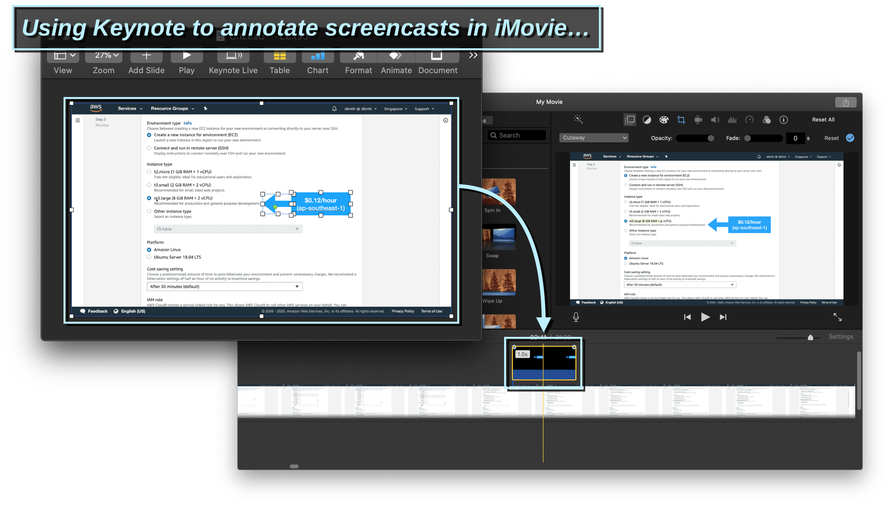

Some applications lets you use drag in an image, but won’t let you paste it in. Others let you copy out an image but won’t let you drag it out.

I made a tool to bridge that gap. As a result, it helps streamline my video editing process and makes it easier for me to communicate visually.

<template>
  <YouTube id="E6aYLVxsRKA" />
</template>

---

Many applications, both web and native, lets you drag in an image file, but won’t let you paste in an image. For example:

- In **Keynote**, if you want to set an image as a slide background, you can drag an image file into the preview box… but you cannot paste in an image from the clipboard.

  

- In **iMovie** (and **Final Cut Pro X**), you can drag in an image file, but you can’t paste in an image from the clipboard.

  

- In **DEV Community’s Markdown editor**, you can drop an image into the “Choose Files” button to upload it, but you cannot paste it in.

  

---

At the same time, many applications lets you copy image data out, but wouldn’t let you do the same with drag-and-drop.

- In **Keynote**, if you select multiple objects, you can copy it out as an image. You can then paste it into other applications as a transparent PNG. This is not possible with drag-and-drop (it moves objects within the slide only).

  

  You can also copy out a whole slide as an image (you can drag it out as well, but you cannot drop it into web applications… they simply won’t recognize it):

  

- In **QuickTime Player**, you can copy out a still image of the current video frame, and paste it into other applications. This is not possible with drag-and-drop.

  

---

So, there’s this disconnect between _drag-and-drop_ and _copy-and-paste_. Bridging them together could potentially unlock a lot of use cases.

For example, I wanted to use **Keynote** to annotate my screencasts, which I edit in **iMovie**.

(I do own Final Cut Pro X, but I find it much more cumbersome to use. It is also much slower. It seems that my MacBook is not expensive enough to deserve Final Cut Pro 😢. But I digress.)

In theory this should work, but there’s a problem:

- I can copy stuff out of my Keynote, but I couldn’t paste it into iMovie.
- I can drag image files into iMovie, but I couldn’t drag things out of Keynote.

---

## Now let me introduce **pastebox**

It is an Electron application that lets you to paste in an image, and then drag it out as a PNG file.

You can get it here:

<template>
  <call-to-action href="https://github.com/dtinth/pastebox">
    GitHub Repository
  </call-to-action>
</template>

I have not set up a release system yet, so you’ll need to compile and run from source code for now. If you want to help out, I would appreciate it a lot.

---

## Bonus: Audio recording

My main motivation for creating this tool is to streamline my video production process, so pastebox also comes with a built-in audio recorder. It uses WebRTC’s noise suppression algorithm to automatically reduce noise.

Press the `r` key to start and stop recording. After recording is finished, press `space` to preview. Once you are satisfied, you can drag it out as a WAV file.

---

## Conclusions

**pastebox** made it much easier for me to produce screencasts using the tools I’m already familiar with (Keynote and iMovie). It also made it much easier for me to communicate visually when using other apps.

I hope you find this useful, and thanks for reading!
